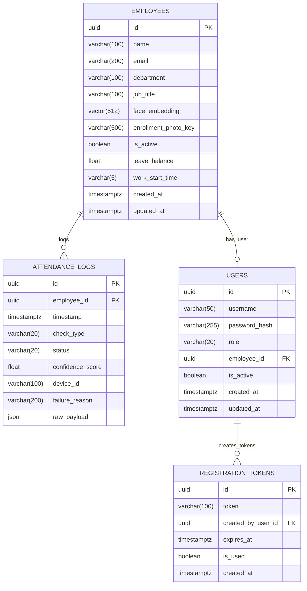

# Database Architecture, Schemas & Access Guide

This document details how to access the database, the full relational schema, vector configurations, and table purposes for the Attendance Tracker system.

---

## 1. How to Access the Database

### Method A: Via Docker CLI (Direct SQL Terminal)
Open PowerShell and run:
```powershell
docker exec -it attendance_postgres psql -U postgres -d attendance_db
```

### Method B: Via Host GUI (DBeaver / pgAdmin / TablePlus / VS Code)
- **Host**: `localhost` (or `127.0.0.1`)
- **Port**: `5432`
- **Database**: `attendance_db`
- **Username**: `postgres`
- **Password**: `postgres`

---

## 2. Table Schemas & Usages



---

### Table 1: `employees`
**Purpose**: Stores company employee records, biometric 512-d ArcFace vectors, work schedule rules, and leave quotas.

| Column | Type | Nullable | Description / Usage |
| :--- | :--- | :--- | :--- |
| `id` | `uuid` | NO (PK) | Primary UUID uniquely identifying the employee. |
| `name` | `varchar(100)` | NO | Employee full name. |
| `email` | `varchar(200)` | YES | Work email address. Unique index if provided. |
| `department` | `varchar(100)` | YES | Department name (e.g. `Engineering`, `Sales`, `HR`). |
| `job_title` | `varchar(100)` | YES | Job title / designation. |
| `face_embedding` | `vector(512)` | YES | **512-dimensional ArcFace deep feature vector** indexed with pgvector for sub-second cosine distance searches. |
| `enrollment_photo_key` | `varchar(500)` | YES | Optional file/MinIO storage path for raw JPEG image. |
| `is_active` | `boolean` | NO | Soft-delete status (`true` = active, `false` = deactivated). |
| `leave_balance` | `float` | NO | Remaining paid leave balance in days (e.g. `14.5`). |
| `work_start_time` | `varchar(5)` | YES | Expected daily arrival time (`09:00` by default). |
| `created_at` / `updated_at` | `timestamptz` | NO | Audit timestamps. |

---

### Table 2: `attendance_logs`
**Purpose**: Immutable event ledger logging every kiosk scan attempt (both successful check-ins/check-outs and failures/spoofs).

| Column | Type | Nullable | Description / Usage |
| :--- | :--- | :--- | :--- |
| `id` | `uuid` | NO (PK) | Primary UUID for the check-in log entry. |
| `employee_id` | `uuid` | YES (FK) | Reference to `employees.id`. `NULL` for unrecognized or spoofed scans. |
| `timestamp` | `timestamptz` | NO | Exact timestamp of camera frame capture. |
| `check_type` | `varchar(20)` | NO | Event classification: `CHECK_IN`, `CHECK_OUT`, or `HALF_DAY`. |
| `status` | `varchar(20)` | NO | `SUCCESS` or `FAILED`. |
| `confidence_score` | `float` | YES | Cosine similarity score between face and database (0.0 to 1.0). |
| `device_id` | `varchar(100)` | YES | Hardware/Kiosk identifier (e.g. `kiosk_front_door`). |
| `failure_reason` | `varchar(200)` | YES | Diagnostic code if rejected (`no_face_detected`, `spoof_detected`, `unknown_face`). |
| `raw_payload` | `json` | YES | Forensic metadata (MiniFASNet `liveness_score`, SCRFD `detection_score`, bbox). |

---

### Table 3: `users`
**Purpose**: System login accounts for Mobile & Web dashboards.

| Column | Type | Nullable | Description / Usage |
| :--- | :--- | :--- | :--- |
| `id` | `uuid` | NO (PK) | User account UUID. |
| `username` | `varchar(50)` | NO | Unique login handle (e.g. `admin`). |
| `password_hash` | `varchar(255)` | NO | Cryptographically hashed password using `bcrypt`. |
| `role` | `varchar(20)` | NO | Role permissions: `super_admin`, `admin`, or `employee`. |
| `employee_id` | `uuid` | YES (FK) | Optional link connecting this login to an employee record. |
| `is_active` | `boolean` | NO | Account active state. |

---

### Table 4: `registration_tokens`
**Purpose**: Time-limited signed invitation tokens for self-service web registration.

| Column | Type | Nullable | Description / Usage |
| :--- | :--- | :--- | :--- |
| `id` | `uuid` | NO (PK) | Token UUID. |
| `token` | `varchar(100)` | NO | High-entropy URL-safe token. |
| `created_by_user_id`| `uuid` | NO (FK) | Admin user who generated the link. |
| `expires_at` | `timestamptz` | NO | Expiration timestamp (defaults to 24 hours). |
| `is_used` | `boolean` | NO | `true` once consumed to prevent reuse. |

---

## 3. Storage Architecture: Photos vs. Embeddings

- **What is currently stored**:
  - The AI pipeline extracts **512 numerical floating-point vectors** (`vector(512)`) and stores them in PostgreSQL.
  - Raw face photos are processed in memory and **not** saved permanently by default to preserve privacy and minimize disk footprint.
- **Can photo viewing be enabled?**:
  - Yes! The `enrollment_photo_key` column and MinIO/filesystem are prepared to optionally save the JPEG images upon enrollment so SuperAdmins can view original photos in the dashboard.
